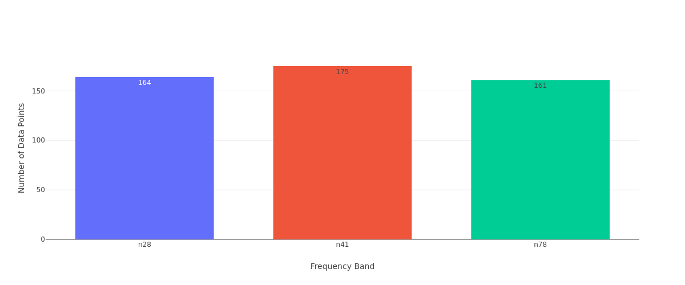

# 📡 5G 信号可视化看板

> **Code with AI 海选赛 — 5G 信号可视化看板挑战**
>
> 交互式 Web 看板，将 5G 路测数据（RSRP/SINR/频段）转化为可视化地图与图表。

---

## ✨ 功能特性

### ✅ 基础关卡（已全部完成）

- **📂 数据加载** — 使用 pandas 读取 CSV 数据，自动预处理（缺失值处理、颜色编码）
- **🗺️ 信号散点地图** — 基于 **Folium** 的交互式 2D 地图，使用 OpenStreetMap 真实地图瓦片作为背景
  - 数据点按 RSRP 信号强度自动变色：
    - 🟢 **绿色** — 信号强（RSRP > -90 dBm）
    - 🟡 **黄色** — 信号一般（-110 ~ -90 dBm）
    - 🔴 **红色** — 信号弱（RSRP < -110 dBm）
  - 支持多图层切换（OpenStreetMap / CartoDB）
  - 图例标注、点击弹窗显示详细信息
- **📊 数据概览图表** — Plotly 交互式图表：
  - 频段基站数量柱状图
  - 终端类型分布饼图

### 🟡 进阶关卡（已全部完成）

- **🔧 侧边栏联动筛选** — 实时筛选器组：
  - 频段多选下拉
  - RSRP 范围滑动条
  - SINR 最低阈值滑动条
  - 终端类型多选
  - Cell ID 搜索框
  - 实时统计数据点数量
- **🌐 3D 地图** — 基于 **PyDeck** (deck.gl) 的 3D 柱状地图
  - 柱子高度代表下载速率 (Download_Mbps)
  - 柱子颜色代表 RSRP 信号强度
  - 支持拖拽旋转、滚轮缩放
- **🧪 工程化素养** — 完整单元测试（39 个测试用例，全部通过）
  - 数据加载测试
  - 颜色映射测试
  - 地图渲染测试
  - 图表生成测试
  - 筛选逻辑测试
  - 端到端集成测试

---

## 🛠️ 技术栈

| 组件 | 技术选型 | 版本 |
|------|----------|------|
| Web 框架 | Streamlit | 1.35.0 |
| 2D 地图 | Folium + streamlit-folium | 0.16.0 |
| 3D 地图 | PyDeck (deck.gl) | 0.9.1 |
| 图表 | Plotly | 5.22.0 |
| 数据处理 | Pandas + NumPy | 2.2.2 |
| 测试框架 | Pytest | 8.2.0 |

---

## 🚀 快速开始

### 环境要求

- Python 3.9+
- pip

### 安装与运行

```bash
# 1. 克隆仓库
git clone <your-repo-url>
cd code-with-ai-contest-token-wireless

# 2. 创建虚拟环境（推荐）
python3 -m venv venv
source venv/bin/activate  # Linux/Mac
# 或
# venv\Scripts\activate  # Windows

# 3. 安装依赖
pip install -r requirements.txt

# 4. 运行看板
streamlit run app.py
```

浏览器会自动打开 `http://localhost:8501`。

### 运行测试

```bash
pytest test_dashboard.py -v
```

---

## 📂 项目结构

```
.
├── app.py                  # 主入口：Streamlit 看板
├── data_loader.py          # 数据加载与预处理
├── sidebar_filter.py       # 侧边栏筛选组件
├── map_visualizer.py       # 地图渲染（2D Folium + 3D PyDeck）
├── chart_generator.py      # 图表生成（柱状图 + 饼图）
├── test_dashboard.py       # 单元测试（39 个用例）
├── data/
│   └── signal_samples.csv  # 5G 路测模拟数据集
├── requirements.txt        # Python 依赖
├── AI_PROMPTS.md           # AI 交互日志（核心验收项）
└── README.md               # 本文件
```

---

## 📸 运行截图

> （截图文件存放于 `screenshots/` 目录）

| 2D 信号地图 | 3D 信号强度地图 | 数据图表 |
|:---:|:---:|:---:|
| [查看交互式 HTML](screenshots/map_2d.html) | [查看交互式 HTML](screenshots/map_3d.html) |  |

> **说明：** 地图为交互式 HTML 文件（Folium / PyDeck），需要用浏览器打开查看。  
> 在终端运行 `streamlit run app.py` 可在浏览器中看到完整的实时看板。

---

## 🤖 AI 辅助开发

本项目全程使用 **Hermes Agent** (AI Coding Agent) 辅助开发。

详见 [`AI_PROMPTS.md`](AI_PROMPTS.md) 中的完整交互日志。

---

## 🏷️ 版本标记

- `basic-done` — 基础关卡完成
- `advanced-done` — 进阶关卡完成

---

## 📄 许可

本项目为 "Code with AI" 比赛参赛作品。
